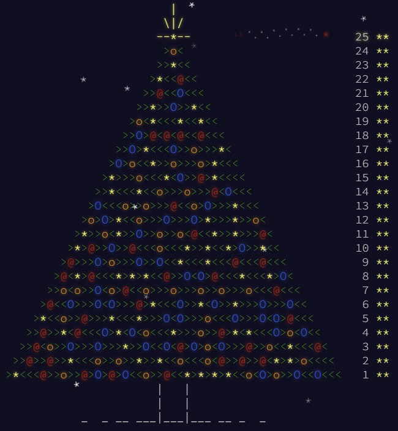

# Advent of Code 2015

Simple project for Advent of Code 2015.

Done in Java. Maybe some in e.g. Kotlin... ;)

For more information see https://adventofcode.com [2015](https://adventofcode.com/2015).

## Current status:

| Day     | Part 1                         | Part 2                          |
|---------|--------------------------------|---------------------------------|
| 1       | ⭐      | ⭐       |
| 2       | ⭐      | ⭐       |
| 3       | ⭐      | ⭐       |
| 4       | ⭐      | ⭐       |
| 5       | ⭐      | ⭐       |
| 6       | ⭐      | ⭐       |
| 7       | ⭐  | ⭐   |
| 8       | ⭐      | ⭐       |
| 9       | ⭐      | ⭐       |
| 10      | ⭐      | ⭐       |
| 11      | ⭐      | ⭐       |
| 12      | ⭐      | ⭐       |
| 13      | ⭐  | ⭐   |
| 14      | ⭐      | ⭐       |
| 15      | ⭐      | ⭐       |
| 16      | ⭐  | ⭐   |
| 17      | ⭐      | ⭐       |
| 18      | ⭐  | ⭐   |
| 19      | ⭐  | ⭐       |
| 20      | ⭐      | ⭐       |
| 21      | ⭐      | ⭐       |
| 22      | ⭐      | ⭐       |
| 23      | ⭐      | ⭐       |
| 24      | ⭐      | ⭐       |
| 25      | ⭐      | ⭐       |
| **SUM** | **25 ⭐**                       | **25 ⭐**                        |

Total: 50 ⭐

## Solution image

